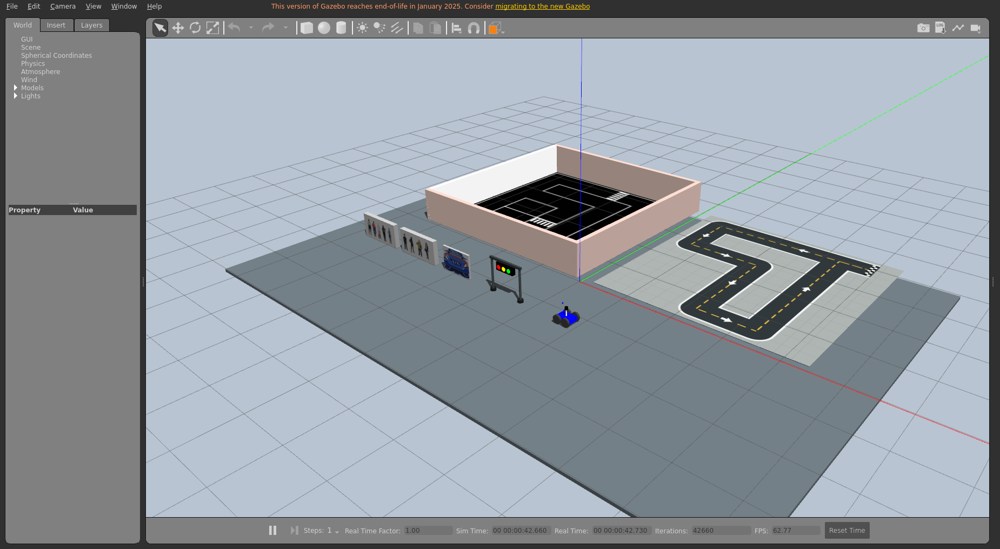
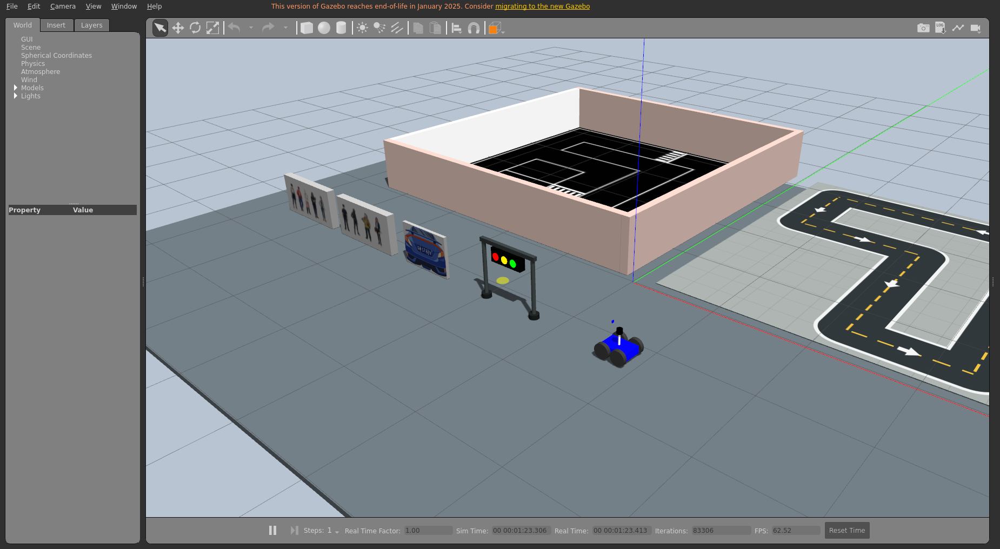

# ROSCar Gazebo Models

智慧社区 ROS 1 仿真的完整模型库，包含比赛场景模型、小车模型、视觉模型和独立 Gazebo 展厅。

## 模型总览





## 模型内容

```text
competition_models/  人物立牌、车辆/车牌立牌、横向红绿灯、地面和围墙
robot/               比赛小车的 Xacro、URDF 和 Gazebo SDF
vision_models/       人物检测与 OCR ONNX 模型
worlds/              模型展厅 world
launch/              ROS 1 启动文件
scripts/             启动和完整性检查脚本
```

## 环境

- Ubuntu 20.04
- ROS 1 Noetic
- Gazebo 11 / Gazebo Classic
- `gazebo_ros`

标准 ROS Noetic 环境可安装：

```bash
sudo apt update
sudo apt install ros-noetic-desktop-full ros-noetic-gazebo-ros-pkgs
```

## 启动展厅

```bash
git clone https://github.com/NHK-DOT/roscar-gazebo-models.git
cd roscar-gazebo-models
./scripts/check_catalog.sh
./scripts/launch_gallery.sh
```

启动脚本使用仓库自身位置，不包含固定的用户目录，因此可以放在任意电脑的任意目录。

无界面运行：

```bash
./scripts/launch_gallery.sh gui:=false
```

如果使用项目附带的便携 ROS 环境，可指定其工作区：

```bash
ROSCAR_WORKSPACE=/path/to/roscar_first_ws ./scripts/launch_gallery.sh
```

关闭时在启动终端按 `Ctrl+C`。

## 部署全部模型

只在当前终端启用模型：

```bash
source setup.bash
```

安装全部 11 个 Gazebo 模型到当前用户目录：

```bash
./scripts/install_models.sh
```

默认安装位置为 `~/.gazebo/models`。脚本会复制人物立牌、车辆/车牌立牌、围墙、两套地面、横向红绿灯主体、三组灯片和比赛小车；若目标位置已有同名模型，安装会停止且不会覆盖原文件。

也可以指定其他 Gazebo 模型目录：

```bash
./scripts/install_models.sh /path/to/gazebo/models
```

人物检测和 OCR 权重保存在 `vision_models/`，小车的可编辑 Xacro、展开 URDF 和独立 SDF 保存在 `robot/`，克隆仓库后即可直接使用。

## 在其他 world 中使用

```bash
export GAZEBO_MODEL_PATH="$PWD/competition_models:$PWD/robot${GAZEBO_MODEL_PATH:+:$GAZEBO_MODEL_PATH}"
```

之后即可通过 `model://ro1`、`model://ro2`、`model://cp`、`model://traffic_light`、`model://map_plane`、`model://my_ground_plane`、`model://map_walls` 和 `model://competition_car` 引用模型。红绿灯动态高亮灯片分别位于 `traffic_light_red_lens`、`traffic_light_yellow_lens` 和 `traffic_light_green_lens`。
